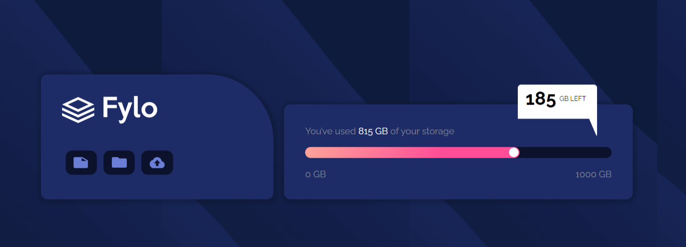

# Frontend Mentor - fylo data solution

This is a solution to the [chat challenge on Frontend Mentor](https://www.frontendmentor.io/challenges/fylo-data-storage-component-1dZPRbV5n/hub). Frontend Mentor challenges help you improve your coding skills by building realistic projects. 

## Table of contents

- [Overview](#overview)
  - [The challenge](#the-challenge)
  - [Screenshot](#screenshot)
  - [Links](#links)
- [My process](#my-process)
  - [Built with](#built-with)
  - [What I learned](#what-i-learned)
  - [Continued development](#continued-development)
  - [Useful resources](#useful-resources)
- [Author](#author)
- [Acknowledgments](#acknowledgments)

## Overview

### The challenge
a chat app build with html and css, with some hover effect
Users should be able to:

- See hover and focus states for all interactive elements on the page

### Screenshot

### Links

- Solution URL: (https://www.frontendmentor.io/profile/Ogshabzy23101/solutions)
- Live Site URL: (https://ogshabzy23101.github.io/fylo-data/)

## My process

### Built with

- Semantic HTML5 markup
- CSS custom properties
- Flexbox
- CSS Grid
- Mobile-first workflow

### What I learned
learnt more about box shadow with this challenge

## Author

- Website - [Damilola Ogundiran](https://ogshabzy23101.github.io/my-portfolio/)
- Frontend Mentor - [@Ogshabzy23101](https://www.frontendmentor.io/profile/Ogshabzy23101)
- Twitter - [@ogshabzy](https://www.twitter.com/ogshabzy)

